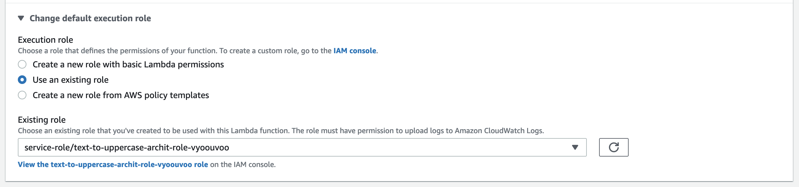

# AWS S3 Object Lambda Workshop
### Lab 2 - Redact PII using AWS Comprehend

Perform all the steps as you had in Lab 1 with the new code and S3 files in Lab2 directory, except while creating the Lambda you will reuse the IAM role which has permissions to interact with S3 Object Lambda. Also, be sure to review the python code to get an understanding of how comprehend is being leveraged to censor PII. 

1. Add the following Comprehend policy to your inline policy created in Lab 1 


2. When creating your lambda, click on _Change default execution role_ and select _Use an existing role_. From the dropdown below, use the Role you had noted down in Lab1. 



#### Challenge
As part of this challenge, try to do the following which will require you to go over the response from AWS Comprehend's PII Entities API [found here](https://docs.aws.amazon.com/comprehend/latest/dg/API_DetectPiiEntities.html):

1. Instead of replacing PII with asterisks, replace it with `<type_of_PII>`. So the string, `My mobile number is 04000 000 000` will be transformed to `My mobile number is <PHONE>`.
2. For the purpose of this challenge, we deem that `NAME` is no longer considered PII. So alter your code so it no longer redacts names from our text. 

<details><summary>Solution</summary>
<p>
```python
transformed_object = original_object.upper().replace(" ", "")
```
</p>
<p>
Using regex is also totally cool
</p>
</details>