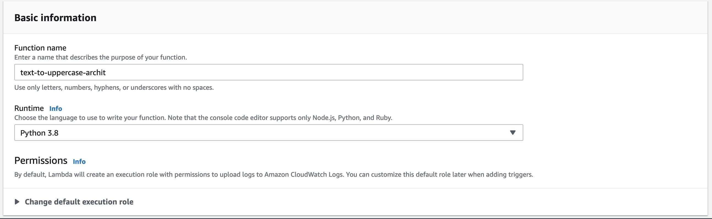
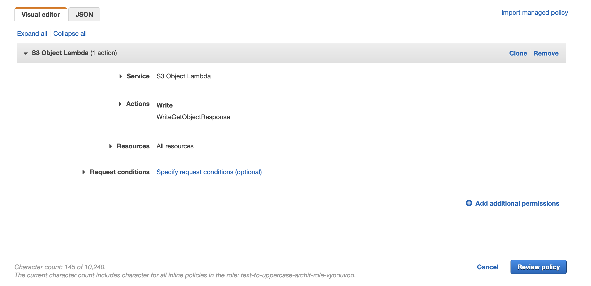
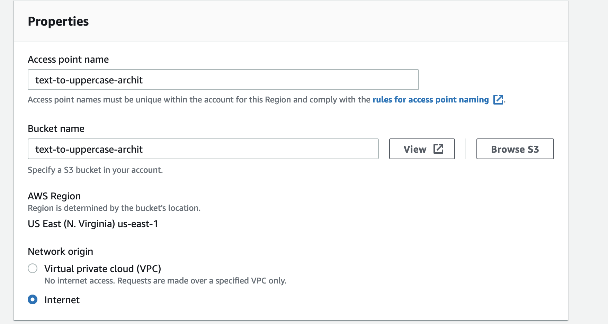

# AWS S3 Object Lambda Workshop
### Lab 1 - First Function

We'll start off with a simple function, one which converts all the text in a file to uppercase and returns it to the user. 

You can reuse the resources created in this Lab in the subsequent ones. 

***

Important Note: Use one region across all the resources you are creating. Since we employ AWS Comprehend in Lab2, please use only one of these regions which support it.
```
Asia Pacific (Mumbai)
Europe (London)
Europe (Ireland)
Asia Pacific (Seoul)
Asia Pacific (Tokyo)
Canada (Central)
Asia Pacific (Singapore)
Asia Pacific (Sydney)
Europe (Frankfurt)
US East (N. Virginia)
US East (Ohio)
US West (Oregon)
```

#### Lambda function
We will first create our lambda function, which will do this transformation:

1. On your terminal go into the [solution](./solution) directory and install our function's requirements using:

```Shell
pip3 install -r requirements.txt -t .
```
Ensure that the `lambda_function.py` is in the same directory as your dependencies so the structure looks something like:
```
.
├── bin
├── certifi
├── certifi-2021.5.30.dist-info
├── chardet
├── chardet-4.0.0.dist-info
├── idna
├── idna-2.10.dist-info
├── lambda_function.py
├── requests
├── requests-2.25.1.dist-info
├── requirements.txt
├── urllib3
└── urllib3-1.26.6.dist-info
```

2. From the solution directory, create a zip of all the dependencies and the function file either using Finder or using the shell command:
```Shell
zip -r9 function.zip .
```
Windows users can archive the directory using the default windows explorer or other 3rd party software. 

3. From the AWS Console, go to Lambda homepage and click on "Create Function".

4. Create a function called `s3-object-lambda-{your_name}` and choose the runtime as Python 3.8 (or the latest version at your discretion). Leave other settings as it is and click on "Create Function"



5. Once your function is created, upload your `function.zip` by clicking on `Upload from` and then select `.zip file`. 

6. Take a minute to go over `lambda_function.py`, particularly of how we're transforming the text to be uppercase.

#### Lambda function Role
Before we can proceed, we need to modify our lambda's role so it can work with S3 Object Lambda. When you created your lambda function, it created a default IAM role which has access to create and write to Cloudwatch Logs. We will amend this role, by adding a new policy:

1. Click on _Configuration_ tab of your lambda function.
2. Click on the link under Permissions > Execution Role > Role Name. Note down this role name, as we will be modifying and using it in the future labs as well.
3. On the IAM console, under _Permissions_ tab, click on _Add Inline Policy_. 
4. Under _Service_, search and select `S3 Object Lambda`
5. Under _Actions_, expand _Write_ and choose _WriteGetObjectResponse_ 
6. Under _Resources_ tab, select _All Resources_. 



7. Click through to Review Policy and put the name as _S3ObjectLambdaWorkshopPolicy-{your\_name}_

We will be modifying this inline policy in future labs. 

#### S3 Bucket

1. From AWS search bar, search and go to S3
2. From the _Buckets_ page, click on _Create Bucket_
3. Put in an easy identifier for your bucket name
4. Leave other settings as they are and click on _Create bucket_
5. Once your bucket is created, upload the two txt files under the [files directory](./files) by going to _Upload_ and _Add files_
6. Take a moment to go over the two files. In a few moments, we will see that the text in these files is all converted to uppercase. 

#### S3 Access Points

S3 Access Points allow our object lambda to fetch the object we're transforming using S3 presigned urls. You can learn more about this S3 feature by going [here](https://docs.aws.amazon.com/AmazonS3/latest/userguide/ShareObjectPreSignedURL.html).

1. From AWS S3 console, go to _Access Points_ in the left panel
2. Click on _Create Access Point_
3. Put in an easy identifier for your access point name
4. Under bucket name, select the S3 bucket you had created earlier. 
5. Select _Internet_ as your Network Origin
6. Click on _Create access point_


#### S3 Object Lambda Access Points

We now have all the resources to create our Object Lambda access point.

1. From AWS S3 console, go to Object Lambda Access Points in the left panel
2. Click on _Create Object Lambda Access Point_
3. Put in an easy identifier for your Object Lambda Access Point name
4. Supporting Access Point, use _Browse S3_ and select the Access Point you had just created.
5. Likewise, select your lambda function from the dropdown and use the `$LATEST` version.
6. Finally, click on _Create Object Lambda Access Point_ 

#### Testing out our function
We will now see if our Object Lambda is working as intended. 

1. Select your S3 Object Lambda Access Point and you should see the objects you have uploaded to your bucket. 
2. Select one or multiple of them and click on _Open_ (Allow pops if needed)
3. You should now see all of the text in scream-case. 😱

***
#### Challenge
A fairly easy one - see if you can strip off all the spaces in your text files in addition to keeping it uppercase. 
<details><summary>Solution</summary>
<p>

```python
transformed_object = original_object.upper().replace(" ", "")
```

</p>
<p>
Using regex is also totally cool
</p>
</details>
