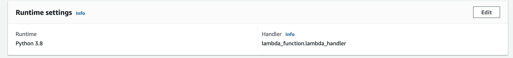

# AWS S3 Object Lambda Workshop
### Lab 4 - Image to thumbnail

Altering images is one of the most common Lambda use-cases. It is often used in conjugation with [AWS Rekognition](https://aws.amazon.com/rekognition/) to do some fancy machine-learning stuff. In this lab, we will keep it simple and use open-source image processing libraries to convert images into thumbnails. 

We will mix things up in this lab and instead of a python function to manipulate the image, we will use Node.js with its fantastic [sharp](https://sharp.pixelplumbing.com/) package.

You can either recreate your lambda and its object lambda access points or you can edit your existing lambda's runtime settings by updating it from _Python 3.8_ to _Node.js 14.x_ and your function handler to _index.handler_



Note: Sharp has platform-specific requirements and hence you'll notice the anomalous [package.json](./solution/package.json#L7) installation script (to learn more see [this](https://sharp.pixelplumbing.com/install#aws-lambda)). This is not best practice and, _in the real world_, you would really be using [Docker with Lambda](https://docs.aws.amazon.com/lambda/latest/dg/images-create.html) and/or [Lambda Layers](https://docs.aws.amazon.com/lambda/latest/dg/configuration-layers.html). This is however is beyond the scope of this workshop. 

Note: increase the execution time of your lambda to 20 seconds for it to run successfully. 

This is the final lab. Once you're done, be sure to check out the `cleanup` branch to delete your resources. 

*** 

#### Image resources
To avoid a copyright notice, I have refrained from adding any images in the [files](./files) folder. However, there are several websites you can use to download stock free images like [Unsplash](https://unsplash.com/images/eople). 

***

#### Challenge
Fairly easy one if you've had a peek at Sharp API documentation. 
We want to make these thumbnails a bit retro so make the images _greyscale_ before we write it out to object lambda.

</p>
</details>
<details>
<summary>Solution</summary>
<p>

```javascript

const resized = await sharp(data)
    .resize({ width: 256, height: 256 })
    .greyscale() //Added this line. 
    .toBuffer();

```

</p>
</details>

