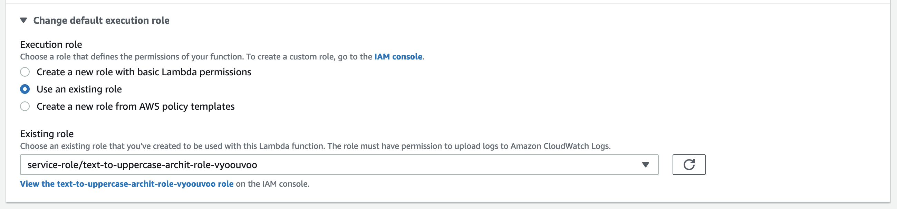

# AWS S3 Object Lambda Workshop
### Lab 3 - Convert CSV to JSON

Perform all the steps as you had in Lab 1 with the new code and S3 files in Lab2 directory, except while creating the Lambda you will reuse the IAM role which has permissions to interact with S3 Object Lambda. 

Consider the new lambda code which converts a csv file into a json stream and returns it back to the object lambda.

As you had in Lab 2, when creating your lambda, click on _Change default execution role_ and select _Use an existing role_. From the dropdown below, use the Role you had noted down in Lab1. 

***

#### Challenge

You can find a csv file with 1,00,00 rows [here](http://eforexcel.com/wp/wp-content/uploads/2017/07/10000-Sales-Records.zip).
If you upload it to your bucket and try to fetch from the object lambda access point, you'll see an error message. 

Why could this be happening? And how can you fix it? 

Hint

By default, lambda has permissions to write out logs to Cloudwatch. 
Go to _Monitor_ tab in your lambda > Logs > View Logs in Cloudwatch. From there click on "Search Log Group" and you'd notice that log message *after* your lambda execution has concluded.

If you cannot see logs or get an error on the Cloudwatch console, you'd need to extend your lambda role. It should already have Cloudwatch log permissions but maybe restricted on `Resources`, so change that to `*` so it unfettered access to create and add logs.

Solution

Increase your lambda timeout to a  higher value ~ around 10 seconds should be enough for this challenge. 
You can do so by going to _Configuration_ tab > _General Configuration_ and change your timeout value. 

It is worth noting that S3 Object Lambdas are required to WriteGetObjectResponse within 60 seconds. ⏱️

