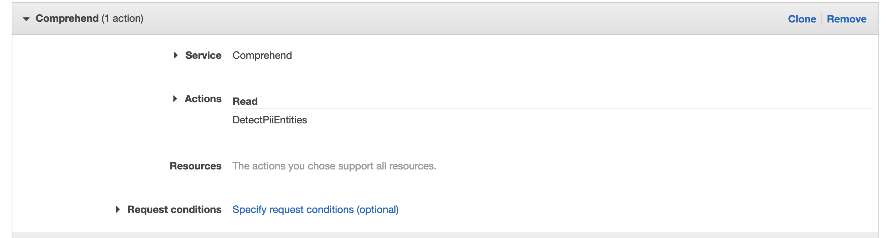

# AWS S3 Object Lambda Workshop
### Lab 2 - Redact PII using AWS Comprehend

Personally identifiable information aka PII is bad, and companies spend hundreds of thousands of dollars to make sure that their customers PII is not leaked. AWS provides a service called [Comprehend](https://aws.amazon.com/comprehend/) which can detect PII in text and in this workshop we will leverage it. 


You can either re-create all resources you had in Lab 1 or reuse the bucket, access points and lambda. You can reinstall your pip dependencies, archive them with your code and then upload it to Lambda via console.

As you had added S3 Object Lambda permissions in Lab 1 to your Lambda IAM role, you'd have to add Comprehend `DetectPiiEntites` permissions so your function can make the required API calls.


***
#### Challenge 1
As part of this challenge, try to do the following which will require you to further examine the response model from AWS Comprehend's Detect PII Entities API [found here](https://docs.aws.amazon.com/comprehend/latest/dg/API_DetectPiiEntities.html):

1. Instead of replacing PII with asterisks, replace it with `<type_of_PII>`. So the text, `My mobile number is 04000 000 000` will be transformed to `My mobile number is <PHONE>`.
2. For the purpose of this challenge, we deem that `NAME` is no longer considered PII. So alter your code so it no longer redacts names from our text. 

<details><summary>Solution</summary>
<p>
One possible solution:

```python
    for entity in filter(lambda pe: pe["Type"].lower() != "name", pii_entities['Entities']):
        secret_entity = original_object[entity["BeginOffset"] : entity["EndOffset"]]
        transformed_object = transformed_object.replace(secret_entity, "<" + entity["Type"] + ">")
```

</p>
</details>


***
#### Challenge 2

A third-party application requires access to your bucket and its files. However, business requirements dictate that any file which _contains any_ PII, should not be returned. Instead, if the application requests for a doc with PII, we should return an `Unauthorized` error. If the doc does not contain any PII, return it as it is. 

For testing purpose you can use the file [zhang_wei_no_pii.txt](./files/zhang_wei_no_pii.txt) which contains redacted PII. 

You can modify your existing lambda and its access point or create new ones. If creating a new lambda, be sure to use the existing role you had noted in Lab 1 or add Comprehend and S3 Object Lambda permissions to your new role.


<details><summary>Hint</summary>
<p>

Detect PII Entities is an expensive (computationally and otherwise) API call. Does the <a href="https://docs.aws.amazon.com/comprehend/latest/dg/API_Operations_Amazon_Comprehend.html" target="_blank">AWS Comprehend Docs</a> have any other API which can be used instead?

Also, note that you needn't create new Access Points or Bucket to solve this challenge. You only need to paste in your code, update IAM Policy (if required).

</p>
</details>
<details>
<summary>Solution</summary>
<p>

A working solution can be found here: https://pastebin.com/s68SDfvy

Make sure your Lambda has ContainsPiiEntities IAM permissions for the above solution to work.

</p>
</details>
